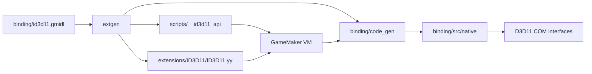

# ID3D11 architecture

## Binding flow



`binding/code_gen` and the generated GML scripts are overwritten by extgen. `binding/src` is the developer-owned implementation layer. `binding/generate.ps1` then performs two deterministic post-passes: it zero-initializes numeric input descriptor constructors and restores the hidden raw bootstrap extension entry.

## Runner bootstrap

GameMaker exposes its D3D11 objects in `os_get_info()` as:

- `video_d3d11_device`
- `video_d3d11_context`
- `video_d3d11_swapchain`

The hidden `__id3d11_bootstrap_raw` entry receives those borrowed pointers. `BridgeState` validates that the context and swap chain belong to the same device, takes its own COM references, records the owner thread, and invalidates all previous handles on reinitialization.

The bootstrap entry is intentionally outside GMIDL because runner pointers use GameMaker's legacy string ABI. `binding/patch-extension.ps1` restores this single entry after every extgen patch pass.

## Handles and ownership

GML never owns or dereferences raw COM pointers. A public handle is a 64-bit value:

```text
63                              32 31                              0
+--------------------------------+--------------------------------+
|          generation            |        slot index + 1          |
+--------------------------------+--------------------------------+
```

- Handle `0` is always invalid.
- Each occupied slot owns a canonical `IUnknown` through `ComPtr`.
- Releasing a handle increments its generation before the slot can be reused.
- A stale GML value therefore cannot alias a newly created COM object.
- The slot also stores `ID3D11HandleKind`; APIs reject handles of the wrong kind.
- `id3d11_handle_query_interface` creates a separately typed handle for supported COM interfaces.

## Errors

HRESULT-returning APIs preserve the HRESULT in their result struct or direct return value and also update `id3d11_get_last_hresult()`. Invalid or stale handles report `E_HANDLE`. Argument validation happens before D3D11 calls where buffer sizes or null data could otherwise cause unsafe reads.

## Binary subresources

Texture initialization uses one GameMaker buffer plus an `ID3D11SubresourceData[]` table. Each entry contains a byte offset, row pitch, slice pitch, and declared byte span. Native code requires exactly the number of subresources implied by mip levels and array size and rejects any span outside the buffer before calling D3D11. This supports mip chains and texture arrays without exposing runner pointers or requiring one native call per subresource.

View descriptors flatten the native discriminated unions into zero-initialized GML structs. `viewDimension` selects which fields are copied into the native union; unused fields stay zero. Unknown dimensions are rejected with `E_INVALIDARG`.

## Shader bytecode

`id3d11_compile_shader` is a convenience transport around the Windows D3D compiler. GML supplies source text plus bytecode and diagnostic output buffers; the result reports the exact required sizes. Shader creation APIs always receive that explicit bytecode size and reject zero, oversized, or out-of-buffer spans before calling D3D11.

The same transport covers vertex, hull, domain, geometry, pixel, and compute shaders. Vertex bytecode is accepted by `CreateInputLayout`; geometry bytecode can additionally be paired with typed Stream Output declarations and stride arrays. A class-linkage handle may be passed to every shader creator, with handle `0` representing native `nullptr`. ClassLinkage APIs expose named-instance lookup and class-instance creation; ClassInstance APIs expose the native descriptor, linkage, instance name, and type name.

## Pipeline state descriptors

Sampler, rasterizer, blend, and depth-stencil descriptors are transported as typed GMIDL structs. The native layer converts each field explicitly instead of sharing binary layouts with the Windows SDK. Blend creation requires exactly the eight render-target entries present in `D3D11_BLEND_DESC`; depth-stencil front/back operations remain nested typed structs in GML. Descriptor getters perform the inverse conversion, so the VM smoke test covers creation and native round trips rather than only successful handle allocation.

D3D11 may normalize descriptor fields that are irrelevant to the selected mode. The sampler smoke test therefore uses anisotropic filtering when checking `MaxAnisotropy`, where that field has defined behavior.

## Asynchronous objects

Base query, predicate, and device-dependent counter descriptors use typed enums and two-field GMIDL structs. Query and predicate handles share the `ID3D11Asynchronous::GetDataSize` transport while preserving their more specific handle kinds. `ID3D11Device::CheckCounter` uses a bounded two-pass native string query to return the driver-provided name, units, description, data type, and active-counter count without exposing native buffers.

Device-dependent counters are optional. The VM smoke test first checks capability: supported counters must create and round-trip successfully, while unsupported adapters must return a failed HRESULT and handle `0`. Query and predicate paths are exercised unconditionally.

The execution layer exposes `DeviceContext::Begin`, `End`, `GetData`, and `Flush`. `GetData` checks the declared byte count against both `UINT` and the actual GameMaker buffer length, rejects unknown flags, and validates that the context and asynchronous object belong to the same D3D11 device. The smoke test submits an event query, flushes, polls it to completion, and verifies the returned native `BOOL`.

## Context execution and resource operations

Direct and instanced Draw calls, DrawAuto, Dispatch, and their indirect variants use synchronous typed wrappers. Indirect calls require a buffer created with `DrawIndirectArgs`, a four-byte-aligned offset, and enough remaining bytes for the exact native argument structure. Dispatch dimensions are checked against the D3D11 per-dimension limit before the context call.

Resource operations validate common device identity and native resource metadata. Whole-resource copies require distinct resources with identical shapes; boxed subresource copies validate subresource indices, source extents, destination bounds, and non-empty boxes. Structure-count copies require an append/counter buffer UAV and an aligned four-byte destination span. Clear calls preserve typed RTV/UAV/DSV handles and validate depth/stencil flags and ranges. GenerateMips and resource MinLOD require their corresponding resource-misc flags, while ResolveSubresource verifies a multisampled 2D source, single-sampled destination, and matching subresource extents.

`UpdateSubresource` validates the resource usage, subresource, format layout, optional box alignment, source span, row pitch, and depth pitch before passing a synchronous `GMBuffer` view to D3D11. The layout module handles ordinary typed and block-compressed color formats; typeless, planar, video, depth/stencil, and other unsupported layouts fail with `E_INVALIDARG` rather than using an estimated footprint.

Mapped pointers are never returned to GML. The map helpers perform `Map`, bounded row/slice copies between a compact GameMaker buffer and the mapped resource, and exactly one `Unmap` in the same native call. They validate usage/CPU-access permissions, sample-count restrictions, output capacity, map flags, and `DO_NOT_WAIT` HRESULTs. This synchronous wrapper intentionally does not expose a reusable map-session handle, so there is no cross-call pointer or double-unmap lifetime.

## Pipeline bindings

The base context binding layer currently covers IA InputLayout, primitive topology, vertex buffers, and index buffer; RS rasterizer state, viewports, and scissor rectangles; OM blend/depth-stencil state, render-target/depth-stencil views, and RT+UAV combo; SO targets; CS unordered-access views; ClearState; deferred contexts and command lists; predication; and shader, constant-buffer, shader-resource-view, and sampler bindings for VS, HS, DS, GS, PS, and CS. A shader binding is a typed shader handle plus up to the D3D11 limit of 256 class-instance handles. Multi-slot and variable-count values cross GMIDL as typed struct arrays or `uint64` handle arrays. Native code validates stage-specific 14/128/16 resource-slot limits, the class-instance limit and device identity, index formats/alignment, viewport depth ranges, rectangle ordering, optional-null handles, and immediate-context thread ownership before touching the context.

Context getters acquire COM references as required by D3D11, intern them through the generation-checked registry, and then release the temporary native references. Because the registry deduplicates by COM identity plus handle kind, the smoke test releases only distinct captured handles. It captures the Runner's original bindings, installs test state, checks the round trip and invalid-input paths, restores the originals, and only then releases test objects. The shader-stage test applies this sequence independently to all six stages so GameMaker's own slot-zero bindings survive the test unchanged.

## Dynamic-linkage driver diagnostic

The GameMaker smoke test compiles a dynamic-linkage pixel shader and verifies ClassLinkage/ClassInstance creation, lookup, descriptors, names, linkage, invalid inputs, and lifetime. It intentionally does not install that dynamic shader on the Runner's hardware context in the currently verified environment.

CDB showed that NVIDIA driver 32.0.15.8228 crashes inside `nvgpucomp64.dll` while compiling the valid `PSSetShader` dynamic-linkage state, before the call returns. The standalone `binding/probes` program reproduces the same failure without GameMaker or the extension, while its `--warp` control run completes with the D3D11 Debug Layer enabled and no validation messages. This isolates the failure to that hardware-driver path; the six-stage public Set/Get implementation remains available, and the regular smoke test still verifies Set/Get/null/restoration with non-dynamic shaders.

Build and run the probe with:

```powershell
cmake -S binding/probes -B binding/out/dynamic-linkage-probe -G "Visual Studio 18 2026" -A x64 -T v145
cmake --build binding/out/dynamic-linkage-probe --config Debug
binding/out/dynamic-linkage-probe/Debug/ID3D11DynamicLinkageProbe.exe --warp
```

## Threading

Bootstrap records the GameMaker thread that owns the immediate context. Current API calls are synchronous; immediate-context entry points reject another thread with `RPC_E_WRONG_THREAD`. Future deferred-context APIs may use another single owning thread, but must not use the runner's immediate context off-thread unless D3D11 multithread protection is explicitly enabled.

## Compatibility

The legacy `GMD3D11.dll`, included-file loading, and `d3d11_*` scripts remain present while migration proceeds. New code should use the `ID3D11` extension and `id3d11_*` names. Compatibility wrappers can later delegate old calls to typed handles once equivalent coverage exists.


Device-child debug names use WKPDID_D3DDebugObjectName; generic private data accepts a GUID string plus GML buffer payload.
